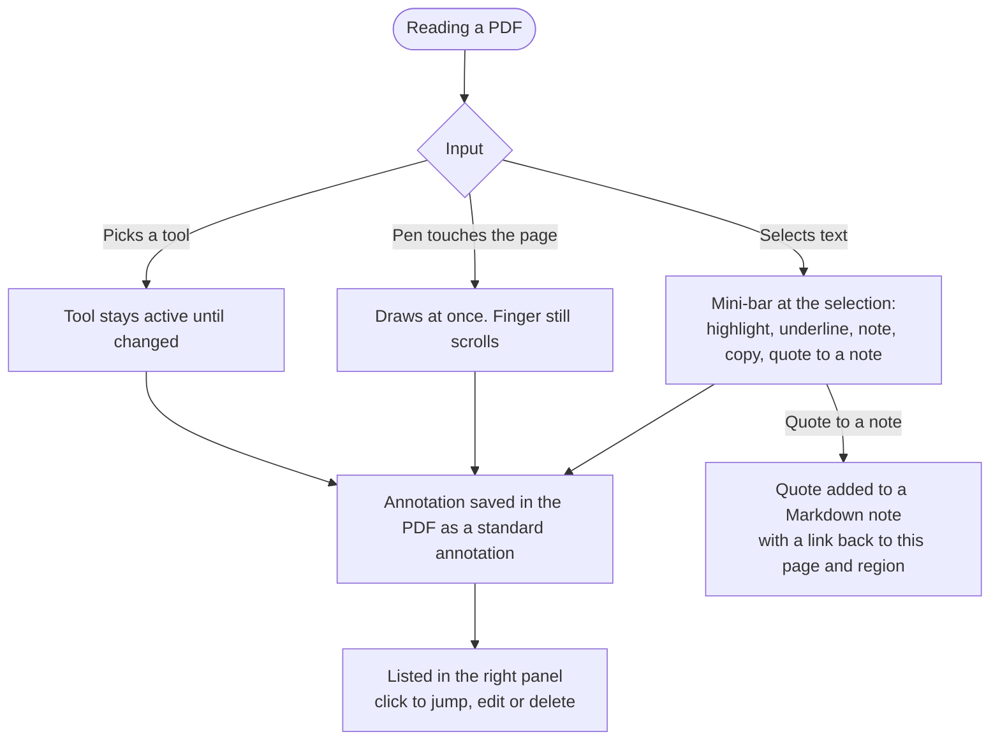
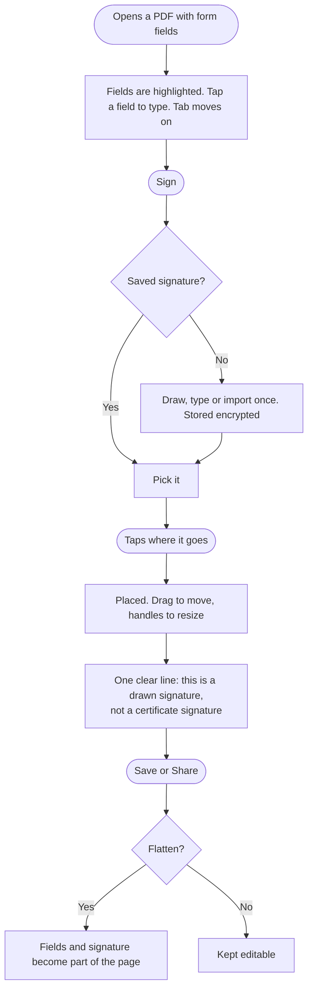
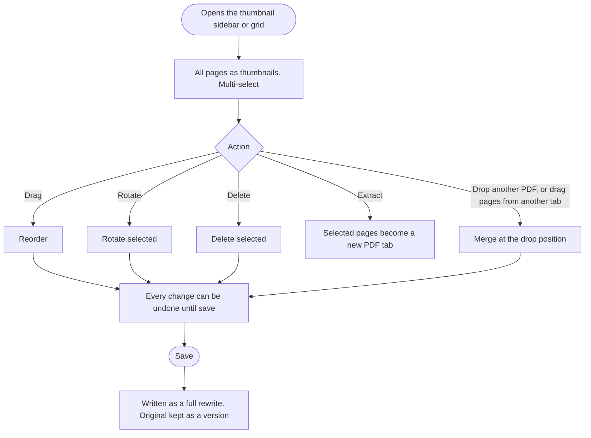

# PDF

## F-22 Highlight, note and draw

```mermaid
flowchart TD
    A(["Reading a PDF"]) --> B{"Input"}
    B -->|Selects text| C["Mini-bar at the selection:<br/>highlight, underline, note, copy, quote to a note"]
    B -->|Pen touches the page| D["Draws at once. Finger still scrolls"]
    B -->|Picks a tool| E["Tool stays active until changed"]
    C --> F["Annotation saved in the PDF as a standard annotation"]
    D --> F
    E --> F
    F --> G["Listed in the right panel<br/>click to jump, edit or delete"]
    C -->|Quote to a note| H["Quote added to a Markdown note<br/>with a link back to this page and region"]
```

## F-23 Fill a form and sign

**Step target: 4 actions to place a saved signature.**

```mermaid
flowchart TD
    A(["Opens a PDF with form fields"]) --> B["Fields are highlighted. Tap a field to type. Tab moves on"]
    B --> C(["Sign"])
    C --> D{"Saved signature?"}
    D -->|Yes| E["Pick it"]
    D -->|No| F["Draw, type or import once. Stored encrypted"]
    F --> E
    E --> G(["Taps where it goes"])
    G --> H["Placed. Drag to move, handles to resize"]
    H --> I["One clear line: this is a drawn signature,<br/>not a certificate signature"]
    I --> J(["Save or Share"])
    J --> K{"Flatten?"}
    K -->|Yes| L["Fields and signature become part of the page"]
    K -->|No| M["Kept editable"]
```

## F-24 Reorganise pages

```mermaid
flowchart TD
    A(["Opens the thumbnail sidebar or grid"]) --> B["All pages as thumbnails. Multi-select"]
    B --> C{"Action"}
    C -->|Drag| D["Reorder"]
    C -->|Rotate| E["Rotate selected"]
    C -->|Delete| F["Delete selected"]
    C -->|Extract| G["Selected pages become a new PDF tab"]
    C -->|Drop another PDF, or drag pages from another tab| H["Merge at the drop position"]
    D --> I["Every change can be undone until save"]
    E --> I
    F --> I
    H --> I
    I --> J(["Save"])
    J --> K["Written as a full rewrite. Original kept as a version"]
```
