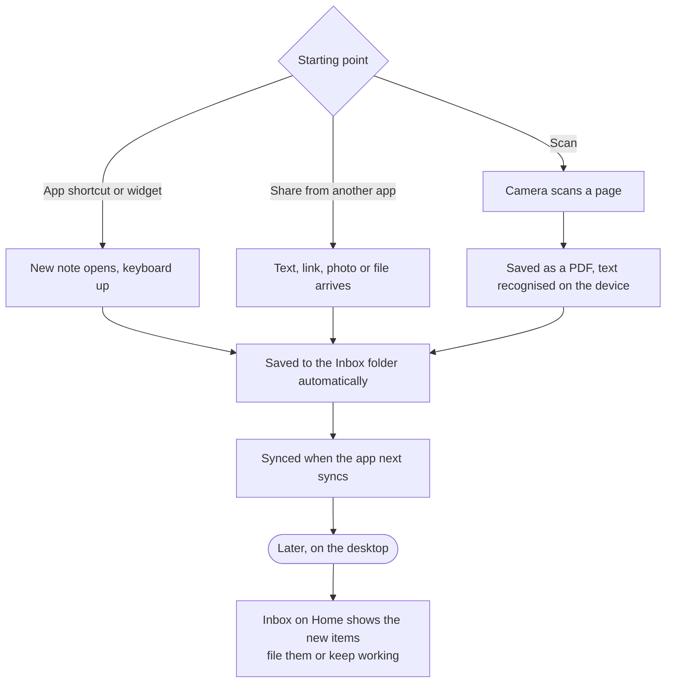
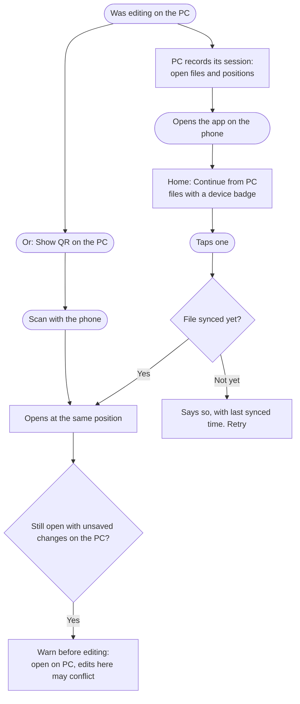
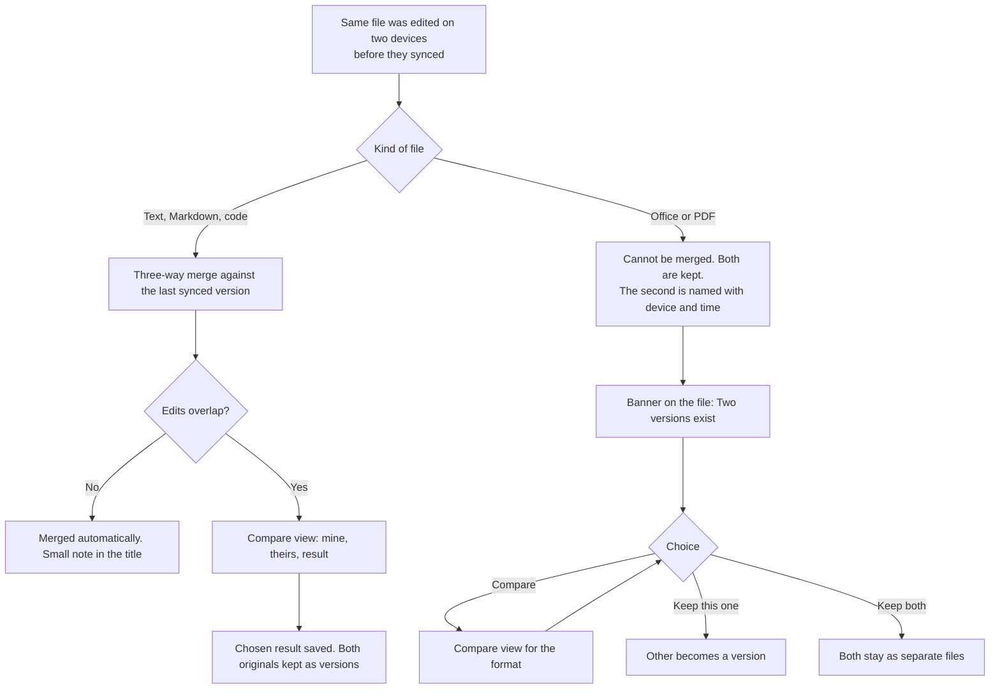

# Across devices

## F-31 Quick capture on the phone

```mermaid
flowchart TD
    A{"Starting point"} -->|App shortcut or widget| B["New note opens, keyboard up"]
    A -->|Share from another app| C["Text, link, photo or file arrives"]
    A -->|Scan| D["Camera scans a page"]
    B --> E["Saved to the Inbox folder automatically"]
    C --> E
    D --> F["Saved as a PDF, text recognised on the device"]
    F --> E
    E --> G["Synced when the app next syncs"]
    G --> H(["Later, on the desktop"])
    H --> I["Inbox on Home shows the new items<br/>file them or keep working"]
```

## F-32 Continue on another device

```mermaid
flowchart TD
    A(["Was editing on the PC"]) --> B["PC records its session:<br/>open files and positions"]
    B --> C(["Opens the app on the phone"])
    C --> D["Home: Continue from PC<br/>files with a device badge"]
    D --> E(["Taps one"])
    E --> F{"File synced yet?"}
    F -->|Yes| G["Opens at the same position"]
    F -->|Not yet| H["Says so, with last synced time. Retry"]
    A --> Q(["Or: Show QR on the PC"])
    Q --> R(["Scan with the phone"])
    R --> G
    G --> S{"Still open with unsaved changes on the PC?"}
    S -->|Yes| T["Warn before editing:<br/>open on PC, edits here may conflict"]
```

## F-13 Sync conflict

Never a silent overwrite.

```mermaid
flowchart TD
    A["Same file was edited on two devices<br/>before they synced"] --> B{"Kind of file"}
    B -->|Text, Markdown, code| C["Three-way merge against the last synced version"]
    C --> D{"Edits overlap?"}
    D -->|No| E["Merged automatically. Small note in the title"]
    D -->|Yes| F["Compare view: mine, theirs, result"]
    B -->|Office or PDF| G["Cannot be merged. Both are kept.<br/>The second is named with device and time"]
    G --> H["Banner on the file: Two versions exist"]
    H --> I{"Choice"}
    I -->|Compare| J["Compare view for the format"]
    I -->|Keep this one| K["Other becomes a version"]
    I -->|Keep both| L["Both stay as separate files"]
    F --> M["Chosen result saved. Both originals kept as versions"]
    J --> I
```
